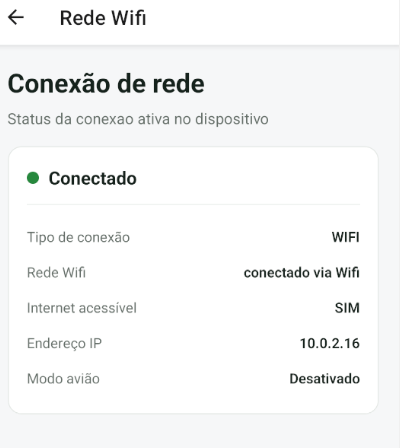

# Expo Network

## Introdução da biblioteca

A biblioteca expo-network permite monitorar e obter informações sobre o estado da conexão de rede e a interface de IP do dispositivo em aplicações React Native/Expo. Com ela, você pode verificar se o usuário está online, qual o tipo de conexão ativa (Wi-Fi, rede móvel, etc.) e se a internet possui acesso real.

## Biblioteca utilizada

```bash
npx expo install expo-network
```

---

A biblioteca é instalada através do comando npm expo install expo-network, depois de instalada, sua importação no projeto é fundamental para seu uso.

## Configuração 

No Android, este módulo requer permissões para acessar a rede e o estado do Wi-Fi. As permissões ACCESS_NETWORK_STATE são ACCESS_WIFI_STATE adicionadas automaticamente.

## Uso da biblioteca 

```javascript
import React, { useCallback, useEffect, useState } from "react";
import { ActivityIndicator, ScrollView, StyleSheet, Text, View } from "react-native";
//importação da biblioteca
import * as Network from 'expo-network';

function InfoRow({ label, value }) {
  return (
    <View style={styles.infoRow}>
      <Text style={styles.infoLabel}>{label}</Text>
      {/* numberOfLines={2}: permite quebra de linha, mas limita a no máximo 2 linhas */}
      <Text style={styles.infoValue} numberOfLines={2}>
        {value}
      </Text>
    </View>
  );
}

export default function RedeWifiScreen() {
    const [info, setInfo] = useState(null);
    const [errorMsg, setErrorMsg] = useState(null);
    const [loading, setLoading] = useState(false);

    const carregaRede = useCallback(async () => {
        setLoading(true);
        setErrorMsg(null);

        try {
            //obtendo informação da rede 
            const stateWifi = await Network.getNetworkStateAsync();
            let ip = 'Indisponível';
            let airplane = false;

            try {
                ip = await Network.getIpAddressAsync();
            } catch {
                ip = 'Indisponível';
            }

            try {
                airplane = await Network.isAirplaneModeEnabledAsync();
            } catch {
                airplane = false;
            }

            setInfo({
                //exibindo informações
                type: stateWifi.type ?? Network.NetworkStateType.UNKNOWN,
                isConnected: stateWifi.isConnected ?? false,
                isInternetReachable: stateWifi.isInternetReachable ?? false,
                ipAddress: ip,
                isAirplaneMode: airplane
            });
        } catch (error) {
            setErrorMsg("Não foi possível obter as informações da rede");
        } finally {
            setLoading(false);
        }
    }, []);

    useEffect(() => {
        carregaRede();

        const subscription = Network.addNetworkStateListener(() => {
            carregaRede();
        });

        return () => subscription.remove();
    }, [carregaRede]);

    const isWifi = info?.type === Network.NetworkStateType.WIFI;
    const tipoLabel = info?.type ?? "Desconhecido";

    return (
        <ScrollView style={styles.screen} contentContainerStyle={styles.content}>
            <Text style={styles.title}>Conexão de rede</Text>
            <Text style={styles.subtitle}>Status da conexao ativa no dispositivo</Text>

            {loading && !info ? (
                <View style={styles.loadingBox}>
                    <ActivityIndicator size="large" color="#25883E" />
                    <Text style={styles.loadingText}>Consultando a rede...</Text>
                </View>
            ) : errorMsg ? (
                <View style={[styles.card, styles.errorCard]}>
                    <Text style={styles.errorText}>{errorMsg}</Text>
                </View>
            ) : (
                info && (
                    <View style={styles.card}>
                        <View style={styles.statusRow}>
                            <View style={[styles.statusDot, { backgroundColor: info.isConnected ? '#25883E' : '#B12727' }]} />
                            <Text style={styles.statusText}>
                                {info.isConnected ? "Conectado" : "Sem conexão"}
                            </Text>
                        </View>

                        <View style={styles.divider}></View> 
                        <InfoRow label="Tipo de conexão" value={tipoLabel} />
                        <InfoRow label="Rede Wifi" value={isWifi ? "conectado via Wifi" : "não conectado via wifi"} />
                        <InfoRow label="Internet acessível" value={info.isInternetReachable ? 'SIM' : 'NÃO'} />
                        <InfoRow label="Endereço IP" value={info.ipAddress} />
                        <InfoRow label="Modo avião" value={info.isAirplaneMode ? 'Ativado' : 'Desativado'} />
                    </View>
                )
            )}
        </ScrollView>
    );
}
```

## Funcionamento (print)



## Vantagens

- Verificação de Estado: Permite checar instantaneamente se o usuário está conectado à internet.
- Endereço IP: Obtém o endereço IP atual do aparelho na rede de forma simples.
- Já vem integrado por padrão no aplicativo de testes Expo Go. 

## Conclusão

A biblioteca `expo-network` facilita a obtenção de informações sobre a conexão do dispositivo, auxiliando no desenvolvimento de aplicações que dependem de internet.

